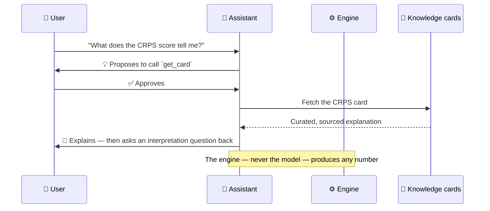
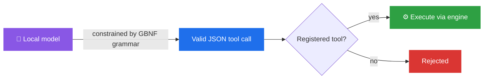

# The AI Assistant

The assistant is a **permanent colleague**, not a chatbot bolted onto the side. It's live on
every page, it never invents a number, and it keeps working even with no model loaded.

---

## The core loop: propose → approve → execute → explain

Everything the assistant does follows one loop. A human always sits between *propose* and
*execute*.

- **Propose** — the assistant suggests a tool call (run a score, fetch a card, build a recipe).
- **Approve** — nothing runs until you say yes. Nothing is auto-run.
- **Execute** — the **engine** does the work and owns any numbers.
- **Explain** — grounded in a curated **knowledge card**, not free invention.

---

## It never invents a number

This is the firewall that makes an AI-assisted verification tool trustworthy. The model's
job is to *route, propose, and explain* — the [engine](architecture.md) computes. Explanations
are drawn from a fixed set of **knowledge cards**, so the assistant can't hallucinate a
formula or a value. → [Verification Science](verification-science.md)

---

## Grammar-constrained tool calling

When the assistant proposes a tool, it isn't free-form text that might or might not parse.
The model is constrained by a **GBNF grammar** so its output is always valid, structured
JSON that maps to a real, registered tool. In the 30-prompt gate, **both models produced
valid JSON 100% of the time**.

---

## Never switched off: the deterministic fallback

Select **"None"** in the model dropdown — or run on a machine that can't host a model at
all — and the dock keeps working. The fallback uses **keyword-matched proposals** and
**template explanations**, so you're never left staring at an empty assistant. This is
Principle 2 in action: *the assistant is always present.*

| | With a model loaded (L3) | Deterministic fallback (L1) |
|---|---|---|
| Proposals | Model-routed, context-aware | Keyword-matched |
| Explanations | Card text, phrased by the model | Card text, templated |
| Numbers | **Engine only** | **Engine only** |
| Requirement | ~2 GB model in RAM | None |

---

## Two models, your choice

Switch models from the dropdown at the top of the dock, on any page — **Ministral 3 3B** or
**Gemma 4 E2B**, both Apache 2.0, both fully local. → Full comparison: **[The Local Models](local-models.md)**
