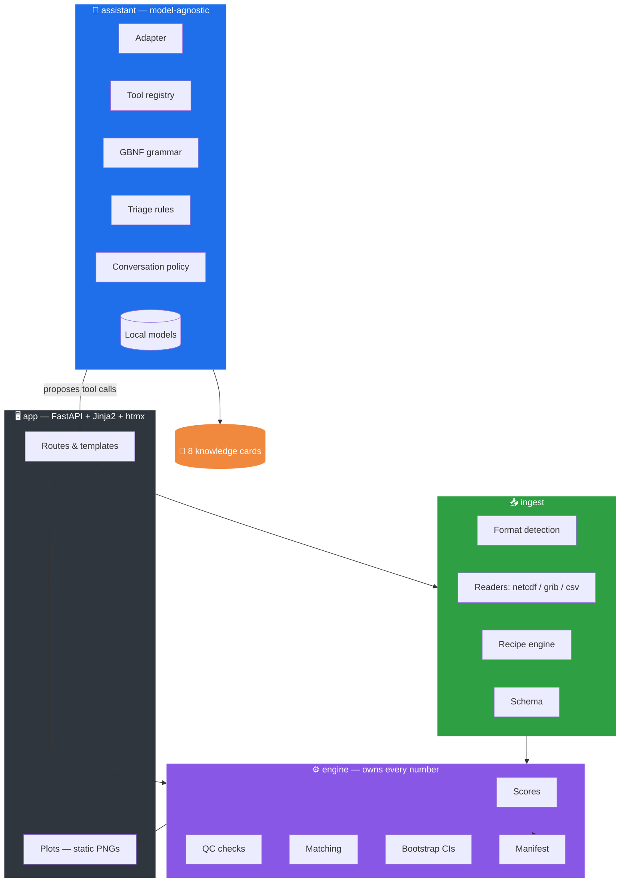
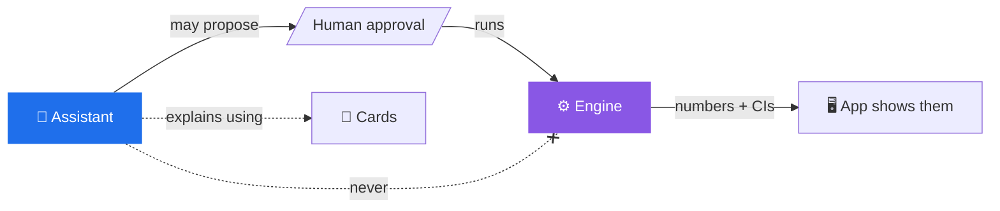

# Architecture

rAIn_check is built as a set of clearly separated layers, with one hard rule at the centre:
**only the engine ever produces a number.** Everything else — ingestion, the app, the
assistant — routes, presents, or explains.



---

## The layers

### ⚙️ `engine/` — the only layer that produces a number
The trust anchor. Deterministic, tested, reproducible.

| Module | Responsibility |
|---|---|
| `scores.py` | CRPS, Brier/BSS, bias, MAE, spread/error — the verification maths |
| `qc.py` | Quality-control checks (the pass / warn / fail badges) |
| `matching.py` | Pairing forecasts with observations in space and time |
| `bootstrap.py` | Moving-block bootstrap confidence intervals |
| `manifest.py` | SHA-256 fingerprints, code version, parameters → `manifest.json` |

### 📥 `ingest/` — get data in, safely
Format detection **from content, not extension**; readers for **NetCDF / GRIB / CSV**; a
**recipe engine** that turns a proposed, human-approved specification into a repeatable
load; and a schema the rest of the system relies on.

### 🖥️ `app/` — the guided rail
FastAPI routes, Jinja2 templates, and **htmx** (vendored, no CDN) drive the five-step rail.
Plots are rendered as **static PNGs** — a deliberate choice for old browsers and tight RAM.

### 🤝 `assistant/` — model-agnostic colleague
A clean **adapter** so the model is swappable; a **tool registry** of things the assistant
may propose; a **GBNF grammar** that forces valid tool calls; **triage rules** and a
**conversation policy**; and the downloaded **local models**. → [The AI Assistant](ai-assistant.md)

### 📇 `cards/` — curated knowledge
Eight Markdown **knowledge cards** the assistant quotes from instead of inventing
explanations. → [Verification Science](verification-science.md)

---

## The one rule, drawn as a boundary



The dashed line is the whole point: the assistant can propose work and explain results, but
the **path to a number always runs through the engine, gated by human approval.**

---

## Repository layout

```
rAIn_check/
  engine/    scores, qc, matching, bootstrap, manifest — the only layer that produces a number
  ingest/    format detection, readers (netcdf/grib/csv), recipe engine, schema
  app/       FastAPI routes, Jinja2 templates, plots, static (htmx vendored)
  assistant/ model-agnostic adapter, tool registry, GBNF grammar, triage, policy, models
  cards/     8 knowledge cards
  data/      golden/ (analytic self-test) and samples/ (demo pack) — regenerated, not committed
  scripts/   make_golden.py, make_demo_pack.py, benchmark_model.py
  tests/     mirrors the packages above — 84 tests
  workspace/ runtime-only: recipes, run logs, reports, model gate report — never committed
```

→ Run it: [Getting Started](getting-started.md) · What's not finished: [Roadmap and Limitations](roadmap-and-limitations.md)
