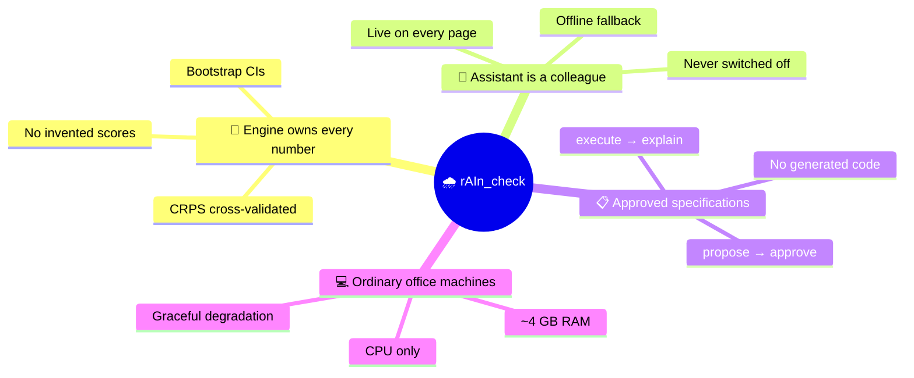
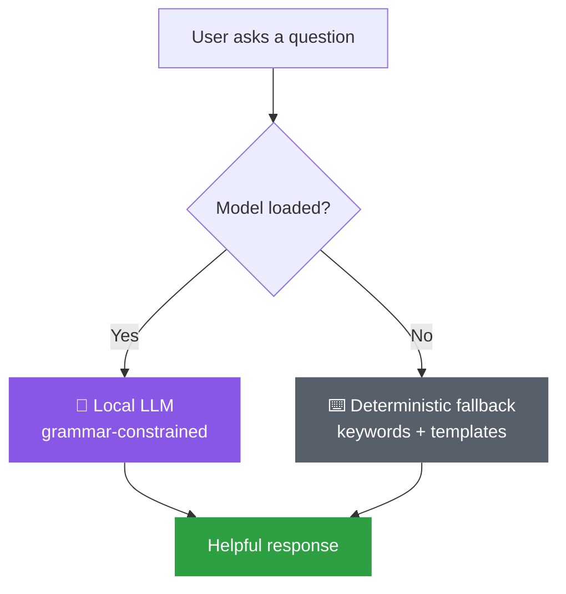
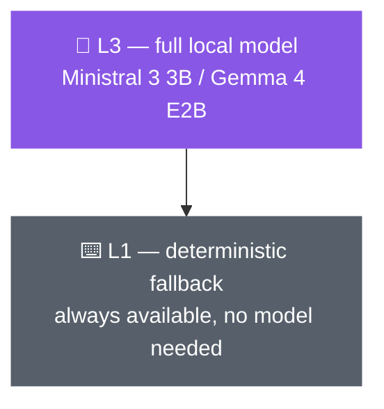

# The Four Design Principles

Four principles carry through every part of rAIn_check. They aren't style choices — each
one falls out of the project's reason for existing: **[data
sovereignty](why-it-exists.md)**.

---

## 🔢 Principle 1 — The deterministic engine owns every number

One layer — the **engine** — is the *only* thing that ever produces a number.

- The AI assistant **never invents** a score, formula, or value from memory.
- Every score comes with **bootstrap confidence intervals** computed by the engine.
- **CRPS is cross-validated to 1e-6** against the independent `properscoring` package.
- Trust flows from **reproducible computation**, not from a model's fluency.

> The assistant can *propose* running a score and *explain* what it means — but the number
> itself always comes from the engine. This is the firewall that makes an AI-assisted tool
> trustworthy for verification work.

→ See it in practice: [Verification Science](verification-science.md)

---

## 🤝 Principle 2 — The assistant is a permanent colleague

The assistant dock is **live on every page** of the five-step rail.

- Always present — *"never switched off."*
- A **no-model deterministic fallback** keeps the dock working with **no LLM loaded** —
  keyword-matched proposals and template explanations.
- The user is **never left staring at an empty assistant**, even on a machine that can't
  run a model at all.

→ Meet the colleague: [The AI Assistant](ai-assistant.md)

---

## 📋 Principle 3 — Extend through approved specifications, not generated code

Users grow the system via **specifications the engine executes** — never generated code.

The loop is always the same:

- Ingestion **recipes** are *proposed* by the assistant and *approved* by the user.
- The engine runs **only what was explicitly approved** — nothing is auto-run.
- Explanations are sourced from **curated knowledge cards**, not free invention.

> Nothing the assistant does is executed until a human says yes. And what runs is a
> specification the engine understands — never arbitrary generated code that could do
> anything.

---

## 💻 Principle 4 — Target ordinary office machines

Designed for **~4 GB-RAM office PCs** — not high-end workstations, not GPUs, not the cloud.

- Tight RAM budgeting — a plan target of **1.8 GB peak at 2k context**.
- Small, quantised local models (**Ministral 3 3B**, **Gemma 4 E2B**) — both Apache 2.0.
- Runs **fully on CPU** — no compiler, no admin rights, no cloud dependency required.
- A **capability ladder** degrades gracefully down to the deterministic fallback.

> Honesty note: on today's build only **L3** and **L1** exist — the intermediate **L2**
> tier is not yet built, and neither model has been re-benchmarked on a true 4 GB machine.
> See [Roadmap and Limitations](roadmap-and-limitations.md).

→ Compare the models: [The Local Models](local-models.md)

---

## In summary: four principles, one purpose

| Principle | The one line |
|---|---|
| 🔢 Engine owns every number | No invented scores. |
| 🤝 Assistant is a permanent colleague | Never switched off. |
| 📋 Extend via approved specifications | Not generated code. |
| 💻 Runs on ordinary office machines | Small, quantised, local. |

**All in service of data sovereignty: verify locally, share only a report + manifest.**
