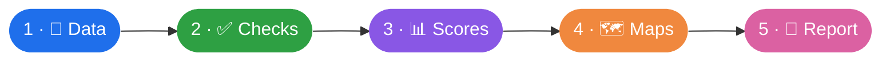
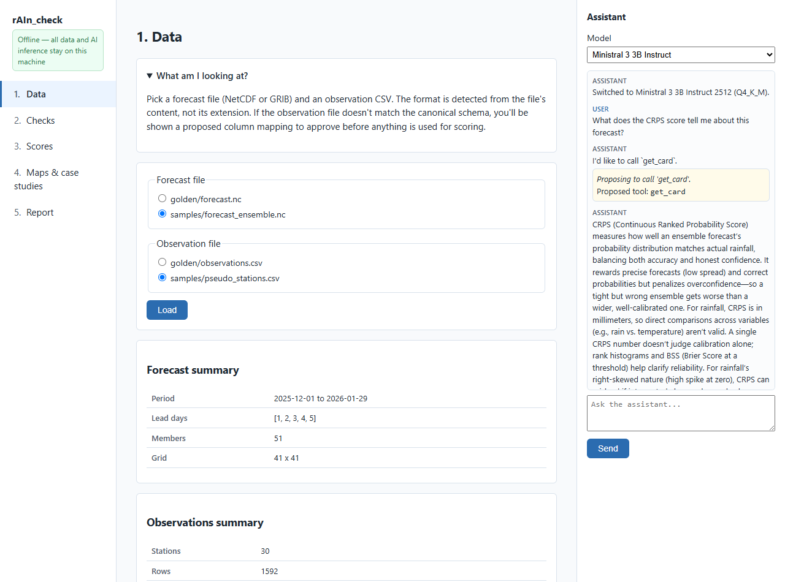
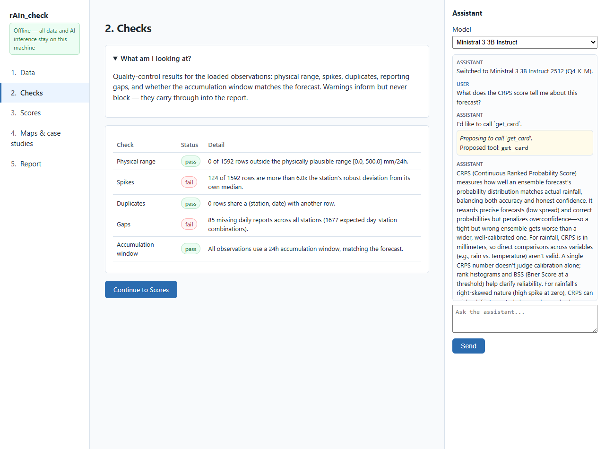
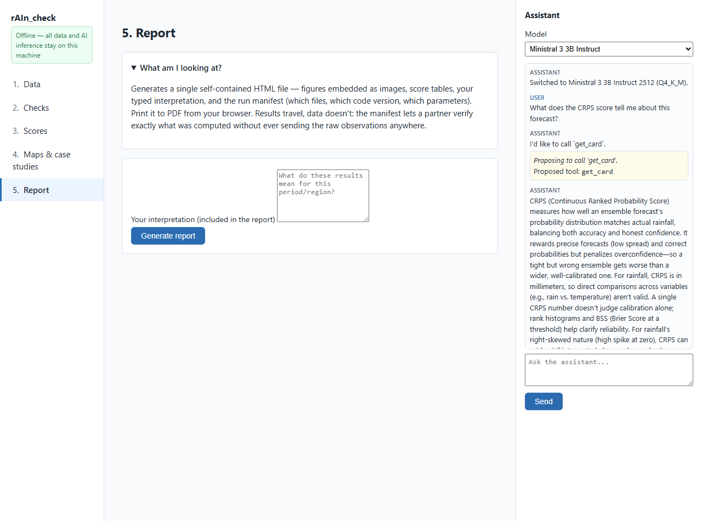

# The Five-Step Rail

rAIn_check guides you along a single, linear **rail** — five steps, in order, with the
[assistant dock](ai-assistant.md) live on every page. This walkthrough uses the synthetic
demo pack (**30 stations, 51-member ensemble**).

---

## 1 · 📂 Data

Pick a forecast file and an observation file. The **format is detected from content, not
from the file extension**, and a summary is shown once the file is loaded. Because the demo
pack's station file is deliberately messy, this is where the assistant may propose an
**ingestion recipe** for you to approve.

---

## 2 · ✅ Checks

Quality-control results, each with a **pass / warn / fail** badge. Warnings *inform but
never block* — you stay in control of whether to proceed.

---

## 3 · 📊 Scores

Choose lead days and thresholds, then compute. **Every figure comes straight from the
deterministic engine** — the assistant can propose this step but never generates the numbers
itself. CRPS and BSS come with **95% confidence intervals** from a moving-block bootstrap,
and any small-sample stratum (n < 30) is flagged.

> In the screenshot: *Lead 1 — 1592 pairs · CRPS 0.42 mm [0.38, 0.47] · Spread/Error 0.92.*
> The bracketed range is the bootstrap confidence interval — the engine's honesty about
> uncertainty. → [Verification Science](verification-science.md)

---

## 4 · 🗺️ Maps & case studies

Spatial views of the forecast: **ensemble mean**, **exceedance probability**, and
**postage-stamp** individual members — with **station observations overlaid**. Filled
circles on the exceedance map mark stations that reported at or above your chosen threshold.

> Maps are rendered as static PNGs — a deliberate choice for old browsers and tight memory.
> Pick a run date, lead day, and threshold, and the maps update.

---

## 5 · 📄 Report

Generates a **single, self-contained HTML file**: embedded figures, score tables, *your*
typed interpretation, and the **run manifest**. This is the artefact a partner shares — and
the reason the observations never have to travel. → [Why rAIn_check Exists](why-it-exists.md)

---

## The assistant, present the whole way

Notice the dock on the right of every screenshot. It follows the same loop at each step —
**propose → approve → execute → explain** — and answers questions grounded in curated
knowledge cards, ending (as good colleagues do) by handing an interpretation question back
to *you*.

→ How the assistant works: **[The AI Assistant](ai-assistant.md)**
