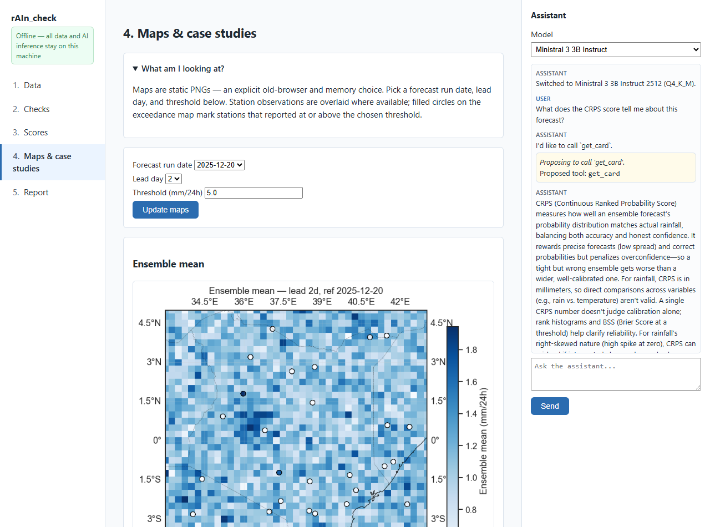

# 🌧️ rAIn_check

### AI-assisted, locally run verification for ensemble rainfall forecasts

*The deterministic engine owns every number. The assistant is a permanent colleague.
You extend the system through approved specifications — never generated code.
And it all runs on an ordinary office machine.*

---

## What it is

**rAIn_check** helps a forecaster answer one question — *how good is this rainfall
forecast?* — without their observation data ever leaving their computer. It pairs a
**deterministic verification engine** (the only thing that ever produces a number) with a
**small, local AI assistant** that proposes, explains, and guides — but never invents a
score.

You walk a five-step rail — **Data → Checks → Scores → Maps → Report** — and finish with a
single self-contained HTML report plus a cryptographic **manifest** that lets a colleague
verify exactly what was computed without ever seeing your raw data.

*The Maps step — ensemble-mean rainfall with station observations overlaid, the assistant
dock live on the right. Everything you see is computed on your machine.*

---

## The four principles at a glance

| | Principle | In one line |
|---|---|---|
| 🔢 | **The engine owns every number** | The AI never invents a score, formula, or value from memory. |
| 🤝 | **The assistant is a permanent colleague** | Live on every page — with a no-model fallback so it's *never* switched off. |
| 📋 | **Extend through approved specifications** | You grow the system with specs the engine executes — not generated code. |
| 💻 | **Target ordinary office machines** | ~4 GB RAM, CPU-only, no admin rights, no cloud. |

→ Read the full story: **[The Four Design Principles](design-principles.md)**

---

## Why it exists: data sovereignty

> Partners verify forecasts on **their own machine**. Observations **never leave it**.
> They share only a **report + `manifest.json`** — never the raw data — and you can still
> verify *exactly* what was computed.

This isn't a bolted-on feature. It's the reason the project exists.
→ **[Why rAIn_check Exists](why-it-exists.md)**

---

## Explore the wiki

| If you want to… | Go to |
|---|---|
| **Run it right now** | [Getting Started](getting-started.md) |
| Understand *why* it's built this way | [Why rAIn_check Exists](why-it-exists.md) · [The Four Design Principles](design-principles.md) |
| See the app, step by step | [The Five-Step Rail](five-step-rail.md) |
| Meet the AI colleague | [The AI Assistant](ai-assistant.md) |
| See how the pieces fit | [Architecture](architecture.md) |
| Understand the scores | [Verification Science](verification-science.md) |
| Compare the local models | [The Local Models](local-models.md) |
| Know what's done vs. left | [Roadmap and Limitations](roadmap-and-limitations.md) |

---

Built against the governing plan. A first end-to-end prototype — honest about what
is and isn't finished. See <a href="roadmap-and-limitations/">Roadmap and Limitations</a>.

