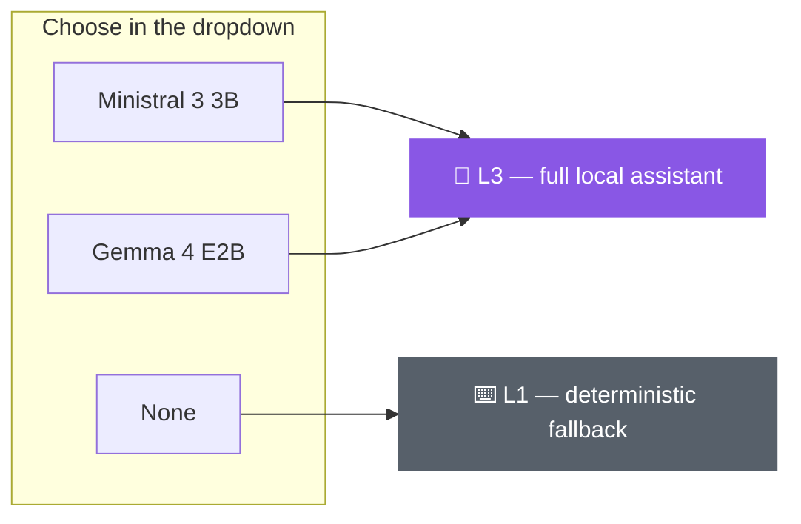

# The Local Models

rAIn_check ships with **two** small, quantised language models — both fully local, both
**Apache 2.0**, both CPU-only. Switch between them (or turn the model off entirely) from the
dropdown at the top of the [assistant dock](ai-assistant.md), on any page.

---

## Side by side

| | **Ministral 3 3B Instruct 2512** (Q4_K_M) | **Gemma 4 E2B** (IQ4_XS) |
|---|---|---|
| 📦 File size | 2.15 GB | 2.98 GB |
| 📜 Licence | Apache 2.0 | Apache 2.0 |
| 🧠 Peak private RAM *(this machine, 2k ctx)* | 2.69 GB | **1.93 GB** |
| ⚡ Tokens / second *(this machine)* | **8.9** | 7.6 |
| ✅ Valid-JSON rate (30-prompt gate) | 100% | 100% |

*Ministral is a little faster; Gemma is a little lighter on RAM. Both hit 100% valid,
grammar-constrained tool calls.*

---

## Both licences are genuinely permissive

Commercial use, modification, and redistribution to partner institutions are **all
allowed** — which matters for a tool meant to be deployed across partner machines.

- **Ministral 3** — Mistral relicensed the Ministral 3 family to **Apache 2.0** in Dec 2025.
- **Gemma 4** — announced April 2026, the **first Gemma generation to drop Google's old
  custom terms** for Apache 2.0.

> These weren't taken on trust from the plan — both were **independently verified** against
> Hugging Face and the vendors' own pages.

---

## "None" is a first-class choice

Selecting **"None"** uses the deterministic (no-LLM) fallback — keyword-matched proposals and
template explanations — so the dock is **never empty**, honouring the *"never switched off"*
principle even on a machine that can't host a model. → [The Four Design Principles](design-principles.md)

---

## Honest note on the RAM target

The plan targets **1.8 GB peak at 2k context**. On a strict "private bytes" reading, **Gemma
comes close (1.93 GB)** and **Ministral is over (2.69 GB)** — and this was measured on a
**32 GB dev machine, not the 4 GB reference machine** the plan targets. Re-run
`benchmark_model.py` on the real target hardware before fixing a default for a partner
deployment. → full detail in [Roadmap and Limitations](roadmap-and-limitations.md).
