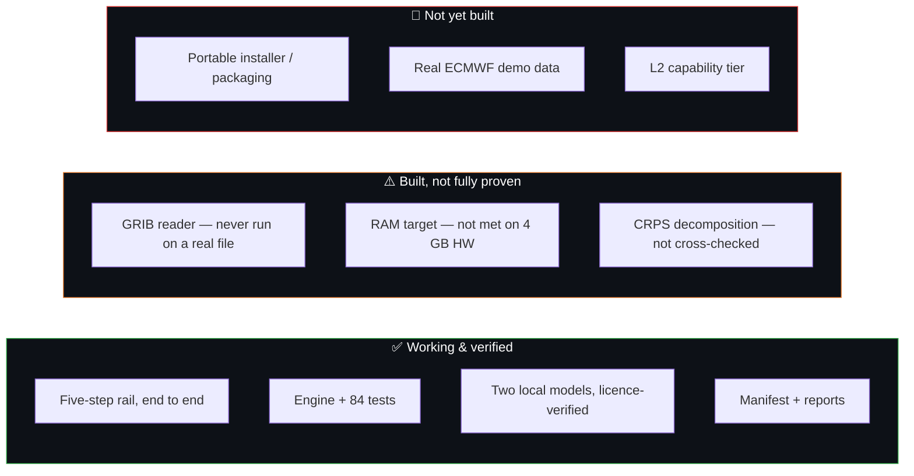

# Roadmap and Limitations

rAIn_check is a **prototype (v0.1.0)** — a genuine end-to-end build, not the full plan. This
page is deliberately candid: knowing exactly what's finished, what's stubbed, and what's
descoped is part of what makes the numbers trustworthy. **Read this before relying on
rAIn_check for real analysis.**

---

## ⚠️ Built, but not fully proven

### RAM gate
The plan targets **1.8 GB peak at 2k context**, gated by `scripts/benchmark_model.py`.
Neither model clears it on a strict private-bytes reading: **Gemma comes close (1.93 GB)**,
**Ministral is well over (2.69 GB)**. Measured on a **32 GB dev machine, not the 4 GB
reference machine** — re-run the benchmark there before choosing a default capability level
for a partner deployment. *(Ministral briefly showed 4 GB — a Windows memory-mapping
artifact, not real pressure.)*

### GRIB reader
Built and unit-tested (including ECMWF's split control/perturbed-member structure), but
**never run against a real downloaded GRIB file** — no live fetch was made. The demo pack is
NetCDF for the same reason. **If your first real file is GRIB, that path is the most likely to
need a fix.**

### CRPS decomposition
The **total** CRPS is fully verified (cross-checked against `properscoring`). The
**Reliability / CRPSpot split** is algebraically self-consistent (the two components sum
exactly to the total) but **not yet checked against Hersbach (2000)'s own terminology**.
→ [Verification Science](verification-science.md)

### Maps offline
Coastlines need a one-time online fetch to cache (already done on the dev machine). A machine
that has **never had a network connection** will get maps **without a basemap** — the data is
still correct, just no coastlines. True offline deployment needs the cartopy cache shipped
with the package.

---

## 🚧 Not yet built

| Item | Status | Note |
|---|---|---|
| **Packaging** | Not started | No conda-pack portable zip, no fresh-VM test. `run.bat` launches the dev venv. Building the real portable installer is the **next major chunk of work**. |
| **Real demo data** | Stubbed | The plan specifies real ECMWF open-data ENS precipitation, but the free feed only carries the last few days; a 60–90 day demo needs MARS access under your own key. `fetch_forecasts` is a **stub**. |
| **Fixtures** | Empty | `data/fixtures/` is empty; equivalent coverage lives inline in `tests/test_ingest/`. Fine for now. |

---

## ✂️ Descoped (per the plan's own ladder)

- The **`quiz` tool** was dropped.
- There's **no L2 capability tier** (a smaller/more-quantised model between full **L3** and
  the deterministic **L1**) — only **L3** and **L1** exist right now. → [The Local Models](local-models.md)

---

## ✅ What *is* solid

So the honesty cuts both ways — this part is real and verified:

- The **five-step rail runs end to end** on the demo pack. → [The Five-Step Rail](five-step-rail.md)
- The **engine is tested** — **84 passing tests**, CRPS cross-validated to 1e-6.
- **Both models** are downloaded, **licence-verified**, and hit 100% valid tool calls.
- The **manifest + report** flow works — the core of data sovereignty. → [Why rAIn_check Exists](why-it-exists.md)

---

A prototype that tells you the truth about itself is a better foundation than a demo that
hides its seams.

