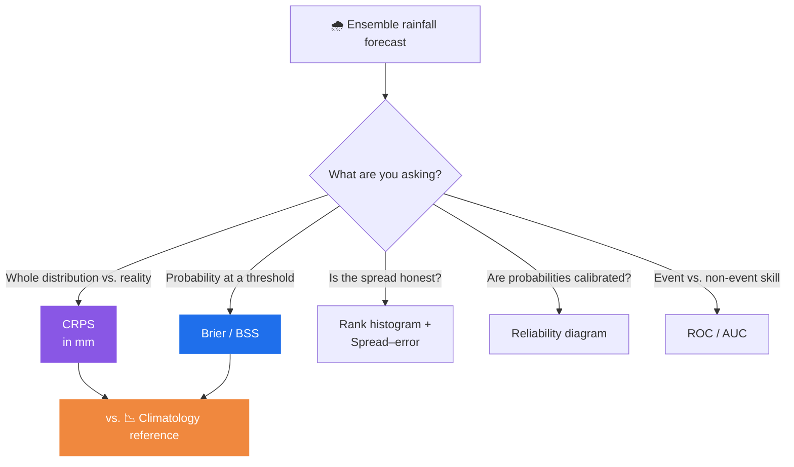

# Verification Science

Verification is the art of asking *how good was this forecast, really?* — and answering it
with numbers you can defend. rAIn_check computes those numbers in the [engine](architecture.md)
and explains them through **eight curated knowledge cards** the [assistant](ai-assistant.md)
quotes from (rather than inventing).

> Every number on this page comes from the deterministic engine, with bootstrap confidence
> intervals. The assistant explains — it never computes. → [The Four Design Principles](design-principles.md)

---

## The eight knowledge cards

Each card is a short, sourced explainer. When you ask the assistant *"what does this score
mean?"*, it fetches the matching card — so the explanation is consistent, grounded, and can't
drift.

| 📇 Card | What it answers |
|---|---|
| **CRPS** | How well does the ensemble's whole probability distribution match what fell? |
| **Brier / BSS** | How good are the probability forecasts *at a rainfall threshold*? |
| **Rank histogram** | Is the ensemble spread right — or over/under-confident? |
| **Reliability diagram** | When it says "70% chance", does it rain 70% of the time? |
| **ROC / AUC** | Can the forecast *discriminate* rain events from non-events? |
| **Spread–error** | Does forecast uncertainty track actual error? |
| **Climatology reference** | The baseline any skilful forecast must beat |
| **Double penalty** | Why a slightly-misplaced feature gets punished twice |

---

## How the headline scores relate

No single number tells the whole story — which is exactly why the assistant, when explaining
CRPS, points you toward rank histograms and BSS to check calibration too.

---

## CRPS — the headline score, and how it's trusted

**CRPS (Continuous Ranked Probability Score)** measures how well an ensemble's probability
distribution matches the rainfall that actually fell — rewarding forecasts that are both
**sharp** (confident) and **honest** (well-calibrated). It's reported in **millimetres**, so
it's directly interpretable. Lower is better.

What makes rAIn_check's CRPS trustworthy rather than just plausible:

- ✅ **Cross-validated to 1e-6** against the independent `properscoring` package.
- ✅ **Hand-checked degenerate cases**: single member, all-zero rainfall, exact ties.
- ✅ **95% confidence intervals** from a moving-block bootstrap on every value.
- ⚠️ **Honesty note:** the *total* CRPS is fully verified; its Reliability / CRPSpot
  **decomposition** is algebraically self-consistent but not yet checked against Hersbach
  (2000)'s terminology. → [Roadmap and Limitations](roadmap-and-limitations.md)

---

## Confidence intervals, not point estimates

Every headline score carries a **bootstrap confidence interval**, and any small-sample
stratum (**n < 30**) is flagged. In the [Scores step](five-step-rail.md) you'll see values
like:

> **CRPS 0.42 mm [0.38, 0.47]** · Spread/Error 0.92 · 1592 pairs

The bracketed range is the engine being honest about uncertainty — a single number without
it would overstate what the data can support.

---

→ See the scores computed live: [The Five-Step Rail](five-step-rail.md) · Meet the explainer: [The AI Assistant](ai-assistant.md)
