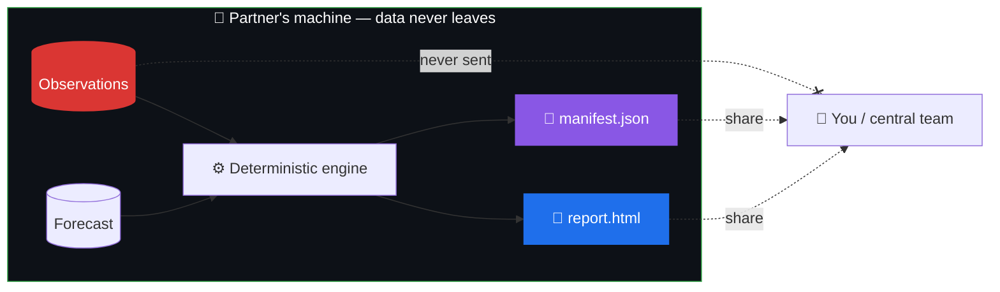

# Why rAIn_check Exists

## The problem: good verification usually means giving up your data

To check how well a rainfall forecast performed, you need two things: the **forecast** and
the **observations** it's measured against. The observations — rain-gauge records, station
reports — are often the most sensitive, most tightly held asset a partner institution has.

The conventional path is to send that data somewhere: to a central server, a shared cloud
bucket, a collaborator's laptop. For many national services and partner institutions, that
is a non-starter. So the verification simply doesn't happen — or happens late, partially,
and without trust.

## The idea: verify locally, share only the proof

rAIn_check flips the arrangement. **The computation goes to the data, not the other way
around.**

The partner runs the whole verification on their own PC. What they send back is only:

- a **self-contained HTML report** (figures, score tables, their written interpretation), and
- a **`manifest.json`** — a small, plain-text record of exactly what was computed.

The underlying observations never travel.

## The manifest: trust without the data

Every score run and every report writes a `manifest.json` containing:

| Field | What it records | Why it matters |
|---|---|---|
| 🔐 **SHA-256 of each input file** | A fingerprint of the exact forecast & observation files used | Proves *which* data produced these numbers — without revealing it |
| 🏷️ **Code version** | The exact build of rAIn_check | The computation is reproducible |
| ⚙️ **Parameters** | Lead times, thresholds, options chosen | No hidden knobs |
| 🕒 **Timestamp** | When the run happened | An audit trail |

Because the manifest fingerprints the inputs cryptographically, **you can verify precisely
what was computed without ever seeing the underlying observations.** If the partner re-runs
with the same files and code, they get the same fingerprints. If anything changed, the
fingerprints change.

> **This is the project's actual reason for existing** — not a bolted-on feature. Every
> design decision downstream (a deterministic engine, a local model, a ~4 GB footprint)
> serves this one goal.

## How the four principles follow from this

Data sovereignty is the root. The [four design principles](design-principles.md)
are what it *forces*:

- If trust can't come from a central server, it must come from **reproducible computation** →
  *the engine owns every number.*
- If the tool runs on the partner's isolated machine, help has to be **built in** →
  *the assistant is a permanent colleague, with an offline fallback.*
- If partners must be able to extend it without shipping code back and forth, extension has
  to be **specification-driven and approved** → *extend through approved specifications.*
- If it has to run on whatever PC the partner already owns, it must fit **~4 GB of RAM,
  CPU-only** → *target ordinary office machines.*

→ Continue to **[The Four Design Principles](design-principles.md)**
