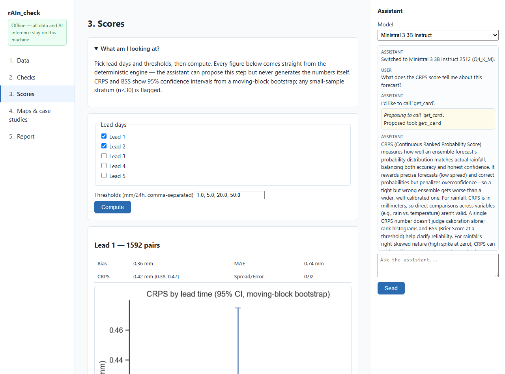
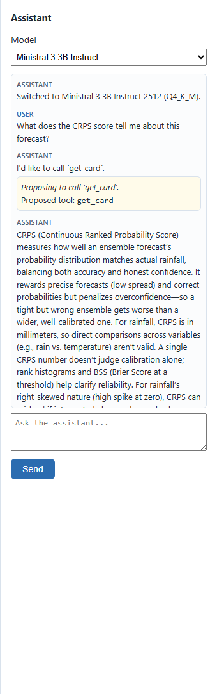

# rAIn_check — prototype (v0.1.0)

AI-assisted, locally run verification for ensemble rainfall forecasts. Built against
[`plans/rAIn_check_plan_v0_0_2.docx`](../plans/rAIn_check_plan_v0_0_2.docx). This is a
first end-to-end prototype, not the full plan — see **Known limitations** below for
exactly what's built versus what's left, and why.

Four principles carried over from the plan and worth restating: the deterministic
engine owns every number; the assistant is a permanent colleague, always present; users
extend the system through approved specifications the engine executes, not through
generated code; and the design targets ordinary office machines, not high-end ones.

## What it looks like

The five-step rail, walked through end to end on the synthetic demo pack (30 stations,
51-member ensemble), with the assistant dock live on every page — here mid-conversation
about the CRPS score with Ministral 3 3B loaded locally.

**1. Data** — pick a forecast + observation file; format detected from content, not
extension; summary shown once loaded.


**2. Checks** — QC results with pass/warn/fail badges; warnings inform but never block.


**3. Scores** — pick leads/thresholds, compute; every number comes from the
deterministic engine, with bootstrap confidence intervals.



**4. Maps & case studies** — ensemble mean, exceedance probability, postage-stamp
members, with station observations overlaid.


**5. Report** — generates a single self-contained HTML file: embedded figures, score
tables, your typed interpretation, and the run manifest.


**The assistant dock**, close up — propose → approve → execute → explain, sourced from
a knowledge card, ending in a genuine interpretation question back to the user:



## Quick start

```
cd rainverify
py -3.11 -m venv .venv
.venv\Scripts\python.exe -m pip install -r requirements.txt
.venv\Scripts\python.exe -m pip install llama-cpp-python==0.3.34 --extra-index-url https://abetlen.github.io/llama-cpp-python/whl/cpu
.venv\Scripts\python.exe scripts\make_golden.py
.venv\Scripts\python.exe scripts\make_demo_pack.py
run.bat
```

`run.bat` opens `http://127.0.0.1:8501` — the guided rail: Data → Checks → Scores →
Maps & case studies → Report. Pick the `samples/` forecast + observation files on the
Data step to try the full flow including a recipe approval (the demo pack's station
file is deliberately messy, on purpose — see `scripts/make_demo_pack.py`).

`llama-cpp-python` needs the separate install line above because there's no C++ compiler
on this machine (no Visual Studio Build Tools, no admin rights assumed) — the plain
`pip install` in requirements.txt tries to build from source and fails; the extra index
serves a prebuilt Windows CPU wheel instead.

## Running tests

```
.venv\Scripts\python.exe -m pytest tests\
```

84 tests, all passing as of this build. Covers: CRPS cross-validated against the
independent `properscoring` package to 1e-6 relative tolerance, hand-computed degenerate
cases (single member, all-zero rainfall, exact ties), the golden-dataset regression
suite, QC checks, ingestion recipes (including a date-format-ambiguity test), the demo
pack's full pipeline end to end, figure rendering, and the assistant (tool registry,
triage rules, knowledge cards, grammar, and two tests that load the real GGUF models and
verify grammar-constrained tool-calling actually works).

## The two models — toggle in the assistant dock

Both are downloaded, licence-verified, and working. Full detail in
[`assistant/models/MODELS.md`](assistant/models/MODELS.md).

| | Ministral 3 3B Instruct 2512 (Q4_K_M) | Gemma 4 E2B (IQ4_XS) |
|---|---|---|
| File size | 2.15 GB | 2.98 GB |
| Licence | Apache 2.0 | Apache 2.0 |
| Peak private RAM (this machine, 2k ctx) | 2.69 GB | 1.93 GB |
| Tokens/second (this machine) | 8.9 | 7.6 |
| Valid-JSON rate (30-prompt gate) | 100% | 100% |

Both licences are genuinely permissive — commercial use, modification, and
redistribution to partner institutions are all allowed. Both are real, current model
releases (Mistral relicensed the Ministral 3 family to Apache 2.0 in Dec 2025; Gemma 4,
announced April 2026, is the first Gemma generation to drop Google's old custom terms
for Apache 2.0) — this was independently verified against Hugging Face and the vendors'
own pages, not taken on the original plan's word.

Switch models from the dropdown at the top of the assistant dock, on any page. "None"
uses the deterministic (no-LLM) fallback — keyword-matched proposals, template
explanations — so the dock is never empty even without a model loaded, per the plan's
"never switched off" principle.

## Known limitations (read before relying on this for real analysis)

**RAM gate**: the plan's target is 1.8GB peak at 2k context, gated by
`scripts/benchmark_model.py`. Neither model clears that on a strict "working set"
reading (Ministral briefly showed 4GB — that's a Windows memory-mapping artifact, not
real pressure; see the script's `_mem_mb` docstring). On the more meaningful "private
bytes" reading, Gemma comes close (1.93GB) and Ministral is well over (2.69GB). This
was run on a 32GB dev machine, not the 4GB reference machine the plan targets — re-run
`benchmark_model.py` there before deciding a default capability level for a partner
deployment. Report: `workspace/model_gate_report.json`.

**GRIB**: the reader is built and unit-tested (including ECMWF's split
control/perturbed-member GRIB structure), but never run against a real downloaded GRIB
file tonight — no live fetch was made. The demo pack is NetCDF, not GRIB, for the same
reason (see `scripts/make_demo_pack.py`'s docstring). If your first real file tomorrow
is GRIB, that code path is more likely than anything else here to need a fix.

**Demo pack is synthetic**: the plan specifies real ECMWF open-data ENS precipitation
for the demo pack, but the free open-data feed only carries the last few days — a
60-90 day demo needs MARS access under your own API key (plan §4.6), which this build
doesn't have. `fetch_forecasts` (the opt-in, network-touching tool that would use that
key) is not implemented — it's a stub.

**Packaging**: no conda-pack portable zip, no fresh-VM test (plan §8 Step S8). `run.bat`
launches the dev venv on this machine. Building the actual portable installer for
partner machines is the next real chunk of work.

**Descoped per the plan's own ladder (§11)**: the `quiz` tool was dropped. There's no L2
capability tier (a smaller/more quantised model between full L3 and deterministic L1) —
only L3 and L1 exist right now.

**Fixtures**: `data/fixtures/` (one sample per supported format, per the plan's layout)
is empty — the equivalent coverage lives inline in `tests/test_ingest/` instead. Fine
for now; worth splitting out if the fixture set grows.

**CRPS decomposition**: the total CRPS number is fully verified (cross-checked against
an independent package). The Reliability/CRPSpot split is algebraically self-consistent
(verified by hand that the two components sum exactly to the total) but not checked
against Hersbach (2000)'s own terminology tonight — see the confidence note in
`engine/scores.py`.

**Maps offline**: coastlines need a one-time online fetch to cache (already done on
this machine, cached under `%USERPROFILE%\.local\share\cartopy`). A machine that has
never had a network connection will get maps without a basemap — data is still correct,
just no coastlines. For true offline partner deployment this cache needs to ship with
the package.

## Repository layout

```
rainverify/
  engine/        scores, qc, matching, bootstrap, manifest — the only layer that
                 produces a number
  ingest/        format detection, readers (netcdf/grib/csv), recipe engine, schema
  app/           FastAPI routes, Jinja2 templates, plots, static (htmx vendored)
  assistant/     model-agnostic adapter, tool registry, GBNF grammar, triage rules,
                 conversation policy, downloaded models
  cards/         8 knowledge cards (CRPS, rank histogram, Brier/BSS, reliability, ROC,
                 spread-error, climatology reference, double penalty)
  data/          golden/ (analytic self-test case) and samples/ (demo pack) —
                 regenerated by scripts/, not committed (see .gitignore)
  scripts/       make_golden.py, make_demo_pack.py, benchmark_model.py
  tests/         mirrors the packages above, one test dir each
  workspace/     runtime-only: recipes, run logs, reports, model gate report — never
                 committed, created on first run
```

## The manifest and data sovereignty

Every score run and every report writes `manifest.json`: SHA-256 of the exact input
files, code version, parameters, timestamp. A partner institution can send you a report
and its manifest without ever sending the underlying observations — you can verify
precisely what was computed, and they never had to leave their machine. This is the
project's actual reason for existing (see the plan's §0), not a bolted-on feature.
